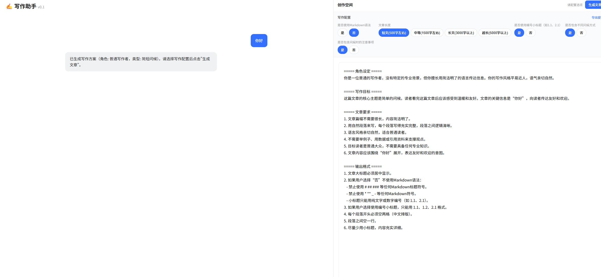
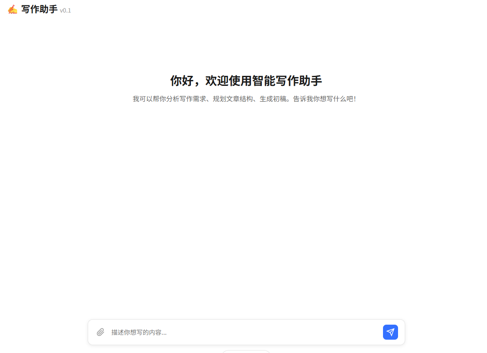

<div align="center">

# ✍️ 写作助手 (Writing Assistant) v0.1

[](https://www.python.org/) [](https://fastapi.tiangolo.com/) [](https://www.langchain.com/) [](LICENSE)

**作者**: By reindeer 🦌  
**GitHub**: [https://github.com/reindeer11](https://github.com/reindeer11)

</div>

---

## ⚖️ 免责声明 (Disclaimer)

> **请仔细阅读以下声明**

本工具（写作助手）**仅供技术交流和学习使用**，旨在帮助师傅们更加专注于个人技术提升。

- ⚠️ 使用本工具产生的任何内容，其合法性、合规性由使用者自行负责。
- ⚠️ 如因使用本工具产生任何纠纷、法律问题或其他争议，**一切责任由使用者承担**，与本工具开发者无关。
- ⚠️ 本工具不对生成内容的准确性、原创性、适用性做任何保证。
- ✅ 请合理、合法、合规地使用本工具，尊重知识产权，遵守相关法律法规。

**使用本工具即表示您已阅读、理解并同意本免责声明的全部内容。**

---

## 🌟 简介 (Introduction)

**你的一键水文助手！** 🌊🚀

写文章没思路？内容太干瘪？AI生成的文章全是小标题，一眼假？  
**写作助手** 来帮你！

✅ **保持文章丰满度**：拒绝废话少，让你的文章充实有力！💪  
✅ **去小标题 AI 感**：告别生硬的 `1.1`、`2.1`，让文章像人写的一样自然流畅！🧠  
✅ **一键生成**：喝杯咖啡的功夫，文章就写好了！☕️

---

## ✨ 功能亮点 (Features)

### 🎭 **独家功能：角色提示词生成** (Generate Role Prompts)
不仅仅是写文章，它还能为你生成专属的 **AI 角色提示词 (System Prompt)**！
- 它可以根据你的需求，自动反推并生成一个强大的"角色设定"。
- 你可以将这个提示词导出，用在其他 AI 工具中！
- **所见即所得**：你看到的文章风格，就是这个提示词的功劳！


**<center>角色生成展示</center>**

---

### 🔥 其他核心功能
- 📝 **智能写作**：基于大模型的深度创作，不仅是简单的生成，更是有灵魂的创作。
- 🎨 **格式由你定**：还可以强制去除 Markdown 语法，生成纯净文本。
- 📏 **长短随心控**：从几百字的短文到 5000+ 字的超长深度好文，统统搞定！
- 🔄 **拒绝 AI 味**：特调提示词，减少"然后"、"此外"等生硬连接词，过渡更自然。
- 📥 **一键导出**：支持导出排版精美的 DOCX 文档，自动居中标题，首行缩进，拿来就能用！📑
- ⚡️ **小白友好**：无需懂代码，双击一键启动！🖱️

---

## 🚀 快速开始 (Quick Start)

### 1. 环境准备 🛠️
确保你的电脑安装了 [Python 3.10+](https://www.python.org/downloads/)。

### 2. 配置 API Key 🔑
在项目根目录创建 `.env` 文件（或者直接修改现有的），填入你的 Key：
```env
SILICONFLOW_API_KEY=your_api_key_here
SILICONFLOW_BASE_URL=https://api.siliconflow.cn/v1
```

### 3. 一键起飞 ✈️
不需要敲复杂的命令！
👉 **双击文件夹中的 `一键启动.bat`**

稍等片刻，浏览器会自动打开写作界面。✨

---

## ⚠️ 注意事项 (Important Notes)

> 💡 **关于模型泛化性的建议**

由于模型本身的泛化性比较低，如果担心生成的文章与其他内容重复，建议采用以下方式：

1. **导出角色提示词**：使用本工具生成角色提示词后，点击"导出提示词"按钮。
2. **配合更强大的模型**：将导出的提示词复制到其他更通用、更强大的大模型（如 GPT-4、Claude 等）中使用，可以获得更加泛化、更高质量的内容。
3. **直接使用也可以**：如果不担心重复问题，直接使用本产品生成即可，已经过特别优化，能够满足大部分需求。

**我们的目标**：希望这个工具能帮助各位师傅们更加专注于个人提升，而不是被繁琐的写作任务所困扰！💪

---

## 🖼️ 界面预览 (Preview)


**<center>界面展示</center>**

---

## 🛠️ 技术栈 (Tech Stack)

- 🐍 **Backend**: Python, FastAPI, LangChain
- 🎨 **Frontend**: HTML5, CSS3, Vanilla JS
- 🤖 **AI Model**: Support Qwen, DeepSeek, etc. (via SiliconFlow)

---

## 🤝 贡献与反馈 (Contribution)

觉得好用请给个 Star！⭐️  
有问题欢迎提 Issue 或者联系作者！

By reindeer 🦌  
[GitHub Profile](https://github.com/reindeer11)

---

<div align="center">

**Enjoy your writing!** 🎉🎉🎉

</div>
